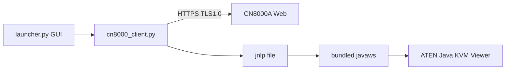

# CN8000A KVM Launcher

Портативный лаунчер для **ATEN CN8000A** (и совместимых CN8000), который позволяет подключаться к KVM с современных Linux и Windows **без установки Java в систему**.

## Суть проблемы

CN8000A отдаёт Java-вьюер через **JNLP** (Java Web Start). На современных ОС это ломается из‑за:

- удаления `javaws` из Java 11+;
- отключения **TLS 1.0 / 1.1** в новых JRE;
- блокировки **MD5**, **SHA1** и коротких RSA-ключей в `java.security`;
- устаревшего HTTPS на самом KVM.

Полностью «нативный» клиент без Java **не существует** — видеопоток и управление реализованы в проприетарном `javaclient.jar` ATEN. Реалистичный путь: **встроенный Java 8 + IcedTea-Web + ослабленный `java.security` только внутри портативного пакета**.

## Что делает это приложение

1. Показывает простое окно: **хост, логин, пароль**.
2. Логинится на веб-интерфейс CN8000 (поддерживаются старый и новый тип прошивки).
3. Скачивает `JavaClient.jnlp` / `Inquery.jnlp`.
4. Запускает **bundled** `javaws` с `resources/java.security.legacy`.

Ничего в систему не ставится — только распаковка AppImage / ZIP.

## Сборка

### Linux → AppImage

```bash
cd cn8000a-launcher
chmod +x scripts/*.sh
./scripts/build-appimage.sh
# Результат: dist/CN8000A-KVM-x86_64.AppImage
chmod +x dist/CN8000A-KVM-x86_64.AppImage
./dist/CN8000A-KVM-x86_64.AppImage
```

Требования для сборки: `curl`, `python3`, `python3-tk`, `unzip`, `fuse` (для AppImage).

### Windows → portable ZIP

На Windows (или cross-build):

```bat
cd cn8000a-launcher
scripts\build-windows.bat
REM Результат: dist\CN8000A-KVM-Portable-Win64\
REM Запуск: dist\CN8000A-KVM-Portable-Win64\CN8000A-KVM.bat
```

Для GUI нужен Python 3 с **tkinter** (в комплекте с официальным Python для Windows). При желании можно дополнительно упаковать через PyInstaller в один `.exe`.

### Только скачать runtime (для разработки)

```bash
./scripts/download-runtime.sh
python3 launcher.py
```

## Ограничения

| Тема | Статус |
|------|--------|
| Работа без Java в системе | Да, runtime внутри пакета |
| Linux Wayland | Нужен **XWayland** / X11 (Java Swing) |
| Размер пакета | ~80–120 МБ (JRE 8 + IcedTea-Web) |
| Безопасность | TLS 1.0/слабые алгоритмы **только** для связи с KVM |
| Полная замена Java-клиента | Нет — нужен оригинальный JAR с устройства |

## Архитектура



## Полезные ссылки

- [sagb/cn8000-cli](https://github.com/sagb/cn8000-cli) — логин и скачивание JNLP из CLI
- [egorsmkv/kvm-over-ip-cn8000a-jnlp-client](https://github.com/egorsmkv/kvm-over-ip-cn8000a-jnlp-client) — Docker + Java 7
- [ATEN FAQ: SHA1 / Unable to launch](https://eservice.aten.com/eServiceCx/Common/FAQ/view.do?id=19062)

## Лицензия

MIT — код лаунчера. JRE/IcedTea-Web и `javaclient.jar` с устройства — лицензии соответствующих правообладателей.
